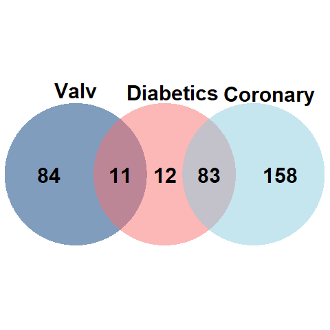

```{r setup, include=FALSE}
library(knitr)
library(ggplot2)
library(plotly)
knitr::opts_chunk$set(message=FALSE,warning=FALSE, cache=TRUE)
knitr::opts_knit$set(root.dir= normalizePath('..'))
knitr::opts_chunk$set(error = FALSE)
knitr::opts_chunk$set(echo = TRUE)
```

```{r echo=FALSE}
dataset <- read.csv("CardiacPredictor/dataset.csv", sep=";", dec = ",")
```
<p style="font-family: Noto Sans, sans-serif; font-size:35pt; font-style:normal; color:#2093C3">
    Data Interpretation
</p>
<p><br></p>
<p><br></p>
# Diabetic patients and reason for admission
***
<p style="font-family: Noto Sans, sans-serif; font-size:13pt; font-style:normal; color:#000000">
After finding a relationship of diabetic patients with the different procedures, we decided to begin to interpret the relationship between the different reasons for admission and diabetes. We did this analysis since both data seemed important to us after the research carried out by reading different papers.
 </p>
```{r include=FALSE}
library(VennDiagram)
myCol <- c("#F86F6F","#8ACBDE","#003A7D")

# Chart
venn.diagram(
  x = list(
    DIABETES = dataset$X[which(dataset$DIABETES == 1)],
    CORONARIO = dataset$X[which(dataset$MOTIVO.DE.INGRESO == "PROG CORONARIO")],
    VALV = dataset$X[which(dataset$MOTIVO.DE.INGRESO == "PROG VALV")]),
  category.names = c("Diabetics" , "Coronary" , "Valv"),
  filename = 'venn_diagramm.png',
  output=TRUE,
  
  # Output features
  imagetype="png" ,
  height = 480 , 
  width = 480 , 
  resolution = 300,
  compression = "lzw",
  
  # Circles
  lwd = 2,
  lty = 'blank',
  fill = myCol,
  
  # Numbers
  cex = .6,
  fontface = "bold",
  fontfamily = "sans",
  
  # Set names
  cat.cex = 0.6,
  cat.fontface = "bold",
  cat.default.pos = "outer",
  cat.pos = c(0, 5, 10),
  cat.dist = c(0.055, 0.055, 0.015),
  cat.fontfamily = "sans",
  rotation = 1
)

```

<p><br></p>
# Female patients older than 60 years whose reason for admission was valve programming and had an open heart surgery

***
<p style="font-family: Noto Sans, sans-serif; font-size:13pt; font-style:normal; color:#000000">
In a research paper, we read the relationship between women over 60 years of age who had entered valve prog and had open heart surgery. This relationship was what helped us to define later the variables used in the predictor. This analysis also helped us to realize that sex was not a significant variable when predicting the type of procedure a patient would have.
</p>
```{r echo=FALSE}
surgeryInWomenOlderThan60<- subset(dataset, dataset$EDAD >= 60 & dataset$SEXO == "FEME" & dataset$PROCEDIMIENTO== "CIRUGIA")
progValv <- round(sum(surgeryInWomenOlderThan60$MOTIVO.DE.INGRESO == "PROG VALV")/length(surgeryInWomenOlderThan60$MOTIVO.DE.INGRESO)*100, 2)
progCoronary <- round(sum(surgeryInWomenOlderThan60$MOTIVO.DE.INGRESO == "PROG CORONARIO")/length(surgeryInWomenOlderThan60$MOTIVO.DE.INGRESO)*100,2)
others <- round(sum(surgeryInWomenOlderThan60$MOTIVO.DE.INGRESO == "ANEURISMA AO")/length(surgeryInWomenOlderThan60$MOTIVO.DE.INGRESO)*100,2)

library(ggplot2)
library(plotly)
dataEntryToHospital <- c(progValv, progCoronary, others)

entryWomenOlderThan60ForSurgery <- plot_ly(type = 'pie', 
                     labels = c("Valve Prog", "Coronary Prog", "Others"), 
                     values = dataEntryToHospital,
                     textinfo='label',
                     insidetextorientation='radial',
                     marker = list(colors = c("#8ACBDE","#003A7D", "#C5C6D0")),
                     title = ""
                     )
entryWomenOlderThan60ForSurgery
```

<p><br></p>
# Severe LVEF values and Post-Op complications
***
<p style="font-family: Noto Sans, sans-serif; font-size:13pt; font-style:normal; color:#000000">
    Many researches have shown that LVEF values have relation with Post-Op surgery complications (hence, the need to study it in our project). Between the 11 patients in surgery with severe LVEF values, 7 of them had complications.
</p>
```{r echo=FALSE}
library(plotly)
severeFey <- subset(dataset,dataset$FEY<=40)
severeFeySurgery <- subset(severeFey,severeFey$PROCEDIMIENTO=="CIRUGIA")
severeFeySurgeryComplications <- round(sum(severeFeySurgery$COMPLICACIONES.INMEDIATAS==1)/length(severeFeySurgery$COMPLICACIONES.INMEDIATAS)*100)
severeFeySurgeryNOComplications <- round(sum(severeFeySurgery$COMPLICACIONES.INMEDIATAS==0)/length(severeFeySurgery$COMPLICACIONES.INMEDIATAS)*100)
FeySevPieval<- c(severeFeySurgeryNOComplications,severeFeySurgeryComplications)
FeySevPielabels<- c(paste("Without: ",severeFeySurgeryNOComplications,"%"),paste("With: ",severeFeySurgeryComplications,"%"))
feySevPie <- plot_ly(type = 'pie', 
                     labels = FeySevPielabels, 
                     values = FeySevPieval,
                     textinfo='label',
                     insidetextorientation='radial',
                     marker = list(colors = c("#003A7D","#F86F6F")),
                     title = ""
                     )
feySevPie
```
<p><br></p>

# Previous angioplasty patients who had a second angioplasty

***
<p style="font-family: Noto Sans, sans-serif; font-size:13pt; font-style:normal; color:#000000">
    Many patients who had undergone an angioplasty, had had another one performed on them before, according to our dataset. The cause for this phenomenon may be that the arteries are blocked or obstructed again (it could be the same or other arteries) which is not a rare risk of a first angioplasty.
</p>
```{r echo=FALSE}
library(tidyr)
previousInterventionAngioplasty <- subset(dataset, dataset$INTERVENCION.PREVIA=="ANGIOPLASTIA")
moreThan1Angioplasty <- sum(previousInterventionAngioplasty$PROCEDIMIENTO == "ANGIOPLASTIA")
only1Angioplasty <- sum(previousInterventionAngioplasty$PROCEDIMIENTO != "ANGIOPLASTIA")
dataset2 <- dataset
dataset2$INTERVENCION.PREVIA <- replace_na("T")
firstAngio <- sum(dataset2$INTERVENCION.PREVIA!="ANGIOPLASTIA" & dataset2$PROCEDIMIENTO=="ANGIOPLASTIA")
noAngio <- sum(dataset2$INTERVENCION.PREVIA!="ANGIOPLASTIA" & dataset2$PROCEDIMIENTO!="ANGIOPLASTIA")
library(plotly)
x <- c('Prev: Angioplasty', 'Prev: Others')
y <- c(moreThan1Angioplasty,firstAngio)
y2 <- c(only1Angioplasty,noAngio)
data <- data.frame(x, y, y2)

angioplasties<- data %>% plot_ly()
angioplasties <- angioplasties %>% add_trace(x = ~x, y = ~y, type = 'bar',
                         name = 'Angioplasty',
                         text = y, textposition = 'auto',
                         marker = list(color = '#003A7D',
                                       line = list(color = '#003A7D', width = 1.5)))
angioplasties <- angioplasties %>% add_trace(x = ~x, y = ~y2, type = 'bar',
                         name = 'Different Procedure',
                         text = y2, textposition = 'auto',
                         marker = list(color = '#8ACBDE',
                                       line = list(color = '#8ACBDE', width = 1.5)))
angioplasties <- angioplasties %>% layout(title = "",
                      barmode = 'group',
                      xaxis = list(title = ""),
                      yaxis = list(title = "Number of Patients"))

angioplasties
```
<p><br></p>
# Immediate and late complications in open heart surgery
***
<p style="font-family: Noto Sans, sans-serif; font-size:13pt; font-style:normal; color:#000000">
We also found it important to analyze how many people suffered some type of complication after having been operated, compared to those who did not have any type of complication, especially to see who, how and how much they were affected by open heart surgeries.

</p>
```{r echo=FALSE}
library(plotly)

CRM_PURE<-subset(dataset,dataset$TIPO.DE.CIRUGIA=="CRM PURA")
immediateComplicationsCRM_PURE<-round(sum(CRM_PURE$COMPLICACIONES.INMEDIATAS == 1)/length(CRM_PURE)*100, digits=2)
lateComplicationsCRM_PURE<-round(sum(CRM_PURE$COMPLICACIONES.TARDIAS == 1)/length(CRM_PURE)*100, digits=2)

RVAO<-subset(dataset,dataset$TIPO.DE.CIRUGIA=="RVAO")
immediateComplicationsRVAO<-round(sum(RVAO$COMPLICACIONES.INMEDIATAS == 1)/length(RVAO)*100, digits=2)
lateComplicationsRVAO<-round(sum(RVAO$COMPLICACIONES.TARDIAS == 1)/length(RVAO)*100, digits=2)

mitralPlastic<-subset(dataset,dataset$TIPO.DE.CIRUGIA=="PLASTICA MITRAL")
immediateComplicationsMitralPlastic<-round(sum(mitralPlastic$COMPLICACIONES.INMEDIATAS == 1)/length(mitralPlastic)*100, digits=2)
lateComplicationsMitralPlastic<-round(sum(mitralPlastic$COMPLICACIONES.TARDIAS == 1)/length(mitralPlastic)*100, digits=2)

RVAo_Aorta<-subset(dataset,dataset$TIPO.DE.CIRUGIA=="RVAo + Aorta")
immediateComplicationsRVAo_Aorta<-round(sum(RVAo_Aorta$COMPLICACIONES.INMEDIATAS == 1)/length(RVAo_Aorta)*100, digits=2)
lateComplicationsRVAo_Aorta<-round(sum(RVAo_Aorta$COMPLICACIONES.TARDIAS == 1)/length(RVAo_Aorta)*100, digits=2)

x <- c('CRM PURA', 'RVAO', 'PLÁSTICA MITRAL', 'RVAo + Aorta')#nombres de c.
y <- c(immediateComplicationsCRM_PURE, immediateComplicationsRVAO,immediateComplicationsMitralPlastic, immediateComplicationsRVAo_Aorta)
y2 <- c(lateComplicationsCRM_PURE,lateComplicationsRVAO,lateComplicationsMitralPlastic, lateComplicationsRVAo_Aorta)
data <- data.frame(x, y)

complicationsInSurgery<- data %>% plot_ly()
complicationsInSurgery <- complicationsInSurgery %>% add_trace(x = ~x, y = ~y, type = 'bar',
                         name = 'Immediate Complications',#inmediatas
                         text = y, textposition = 'auto',
                         marker = list(color = '#003A7D',
                                       line = list(color = '#003A7D', width = 1.5)))
complicationsInSurgery <- complicationsInSurgery %>% add_trace(x = ~x, y = ~y2, type = 'bar',
                         name = 'Late Complications',#tardias
                         text = y2, textposition = 'auto',
                         marker = list(color = '#8ACBDE',
                                       line = list(color = '#8ACBDE', width = 1.5)))
complicationsInSurgery <- complicationsInSurgery %>% layout(title = "",
                      barmode = 'group',
                      xaxis = list(title = ""),
                      yaxis = list(title = "% of Complications"))

complicationsInSurgery
```
<p><br></p>
# Extracorporeal circulation
***
<p style="font-family: Noto Sans, sans-serif; font-size:13pt; font-style:normal; color:#000000">
Extracorporeal circulation refers to the circulation of blood outside of the body through a machine that temporarily assumes an organ's functions (eg. heart and lungs). The following bar graph shows the immediate complications on patients who underwent open heart surgery and extracorporeal circulation compared to those who did not have extracorporeal circulation. 
</p>
```{r echo=FALSE}
CEC<-subset(dataset,dataset$CIRCULACION.EXTRACORPOREA!="NO")
CECNO<-subset(dataset,dataset$CIRCULACION.EXTRACORPOREA=="NO")
immediateComplicationsCEC<-sum(CEC$COMPLICACIONES.INMEDIATAS == 1)
noimmediateComplicationsCEC <-sum(CEC$COMPLICACIONES.INMEDIATAS == 0)
immediateComplicationsCECNO <-sum(CECNO$COMPLICACIONES.INMEDIATAS == 1)
noimmediateComplicationsCECNO <-sum(CECNO$COMPLICACIONES.INMEDIATAS == 0)
library(plotly)

x <- c('CEC', 'Without CEC')
y <- c(immediateComplicationsCEC,immediateComplicationsCECNO)
y2 <- c(noimmediateComplicationsCEC,noimmediateComplicationsCECNO)
data <- data.frame(x, y, y2)

immediateComplicationsAndCEC <- data %>% plot_ly()
immediateComplicationsAndCEC <- immediateComplicationsAndCEC %>% add_trace(x = ~x, y = ~y, type = 'bar',
                         name = 'With Complications',
                         text = y, textposition = 'auto',
                         marker = list(color = '#F86F6F',
                                       line = list(color = '#F86F6F', width = 1.5)))
immediateComplicationsAndCEC <- immediateComplicationsAndCEC %>% add_trace(x = ~x, y = ~y2, type = 'bar',
                         name = 'Without Complications',
                         text = y2, textposition = 'auto',
                         marker = list(color = '#003A7D',
                                       line = list(color = '#003A7D', width = 1.5)))
immediateComplicationsAndCEC <- immediateComplicationsAndCEC %>% layout(title = "",
                      barmode = 'group',
                      xaxis = list(title = ""),
                      yaxis = list(title = "Number of Patients"))

immediateComplicationsAndCEC
```
<p><br></p>

# Complications in open heart surgery patients who entered for Programmed Coronary
***
<p style="font-family: Noto Sans, sans-serif; font-size:13pt; font-style:normal; color:#000000">
Most of the patients in our data set who entered by coronary prog had angioplasty as the procedure, but there was a significant number of patients, exactly 47 who underwent surgery and that is why we were interested in analyzing their relationship with complications.
</p>
```{r echo=FALSE}
library(plotly)
ProgYCirujia <- subset(dataset,dataset$MOTIVO.DE.INGRESO=="PROG CORONARIO" & dataset$PROCEDIMIENTO=="CIRUGIA") 

immediateComplicationsProgYCirujia<-round(sum(ProgYCirujia$COMPLICACIONES.INMEDIATAS == 1))
noImmediateComplicationsProgYCirujia<-round(sum(ProgYCirujia$COMPLICACIONES.INMEDIATAS == 0))


lateComplicationsProgYCirujia<-round(sum(ProgYCirujia$COMPLICACIONES.TARDIAS == 1))
noLateComplicationsProgYCirujia<-round(sum(ProgYCirujia$COMPLICACIONES.TARDIAS == 0))

x <- c('Immediate Complications', 'Late Complications')#nombres de c.
y <- c(immediateComplicationsProgYCirujia, lateComplicationsProgYCirujia)
y2 <- c(noImmediateComplicationsProgYCirujia, noLateComplicationsProgYCirujia)
data <- data.frame(x, y)

complicationsInSurgery<- data %>% plot_ly()
complicationsInSurgery <- complicationsInSurgery %>% add_trace(x = ~x, y = ~y, type = 'bar',
                         name = 'Yes',#inmediatas
                         text = y, textposition = 'auto',
                         marker = list(color = '#F86F6F',
                                       line = list(color = '#F86F6F', width = 1.5)))
complicationsInSurgery <- complicationsInSurgery %>% add_trace(x = ~x, y = ~y2, type = 'bar',
                         name = 'No',#tardias
                         text = y2, textposition = 'auto',
                         marker = list(color = '#003A7D', 
                                       line = list(color = '#003A7D', width = 1.5)))
complicationsInSurgery <- complicationsInSurgery %>% layout(title = "",
                      barmode = 'group',
                      xaxis = list(title = ""),
                      yaxis = list(title = "Number of pacients"))

complicationsInSurgery
```
<p><br></p>
# Complications in male patients older than 60 years
***
<p style="font-family:Noto Sans, sans-serif; font-size:13pt; font-style:normal; color:#000000">
After focusing on the complications that existed with different data from patients who underwent surgery, it seemed important to highlight the difference between the complications of patients who underwent surgery vs those undergoing angioplasty.
</p>
```{r echo=FALSE}
menOlderThan60<- subset(dataset, dataset$EDAD >= 60 & dataset$SEXO == "MASC")
menOlderThan60WithAngioplasty<- subset(menOlderThan60, menOlderThan60$PROCEDIMIENTO == "ANGIOPLASTIA")
menOlderThan60WithSurgery <- subset(menOlderThan60, menOlderThan60$PROCEDIMIENTO == "CIRUGIA")

library(plotly)
library(ggplot2)
x <- c("Angioplasty", "Surgery - Immediate", "Surgery- Late")
y1 <- c(sum(menOlderThan60WithAngioplasty$COMPLICACIONES.ANGIOPLASTIA== 0), sum(menOlderThan60WithSurgery$COMPLICACIONES.INMEDIATAS == 0), sum(menOlderThan60WithSurgery$COMPLICACIONES.TARDIAS == 0) )
y2<- c(sum(menOlderThan60WithAngioplasty$COMPLICACIONES.ANGIOPLASTIA == 1), sum(menOlderThan60WithSurgery$COMPLICACIONES.INMEDIATAS == 1), sum(menOlderThan60WithSurgery$COMPLICACIONES.TARDIAS == 1))
data <- data.frame(x, y1, y2)

complicationsInMenOlderThan60 <- plot_ly(data, x = ~x, y = ~y1, type = 'bar', name = 'Without Complications', marker = list(color = '#003A7D'))
complicationsInMenOlderThan60 <- complicationsInMenOlderThan60 %>% add_trace(y = ~y2, name = 'With Complications', marker = list(color = '#F86F6F'))
complicationsInMenOlderThan60 <- complicationsInMenOlderThan60 %>% layout(xaxis = list(title = "", tickangle = 0),
                      yaxis = list(title = "Number of Patients"),
                      margin = list(b = 100),
                      barmode = 'group')
complicationsInMenOlderThan60
```
<p><br></p>
# Injuries in Angioplasty
***
<p style="font-family: Noto Sans, sans-serif; font-size:13pt; font-style:normal; color:#000000">
The number of injuries in the different blood vessels of the patients is important since both this and the injured vessels determine the complexity of the surgery and therefore the choice of procedure.
</p>
```{r echo=FALSE}
patientsWithAngioplasty <- subset(dataset,dataset$PROCEDIMIENTO == "ANGIOPLASTIA")
zeroInjuries <- 12
oneInjury <- 78
twoInjuries <- 79
threeInjuries <- 25
fourInjuries <- 6
library(plotly)
library(ggplot2)
x <- c('0', '1', '2', '3', '4')
y <- c(zeroInjuries, oneInjury, twoInjuries, threeInjuries, fourInjuries)
data <- data.frame(x, y)
fig <- plot_ly(data, x = ~x, y = ~y, type = 'bar',
             text = y, textposition = 'auto',
             marker = list(color = '#8ACBDE',
                           line = list(color = '#8ACBDE', width = 1.5)))
fig <- fig %>% layout(title = "",
         xaxis = list(title = "Number of Injuries"),
         yaxis = list(title = "Number of Patients"))
fig
```