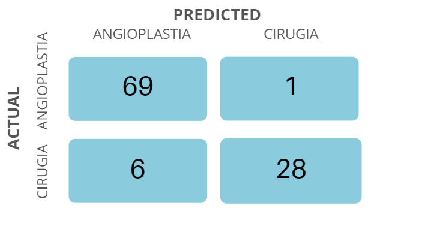
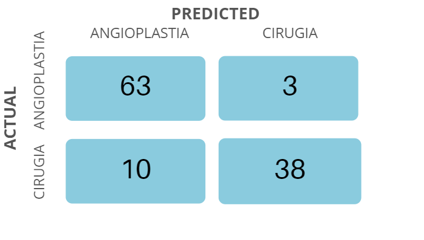
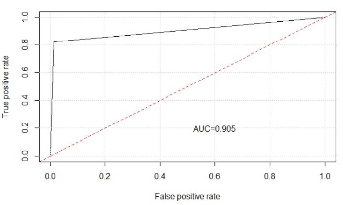

```{r setup, include=FALSE}
library(knitr)
library(ggplot2)
library(plotly)
knitr::opts_chunk$set(message=FALSE,warning=FALSE, cache=TRUE)
knitr::opts_knit$set(root.dir= normalizePath('..'))
knitr::opts_chunk$set(error = FALSE)
knitr::opts_chunk$set(echo = TRUE)
```


```{r include=FALSE}
dataset <- read.csv("CardiacPredictor/dataset.csv", sep=";", dec = ",")
```

<p style="font-family: Noto Sans, sans-serif; font-size:35pt; font-style:normal; color:#2093C3">
    Predictor
</p>
<p style="font-family: Noto Sans, sans-serif; font-size:13pt; font-style:normal; color:#000000">
After researching, a decision has been made to predict the procedure a patient will go to.
The different factors taken into account were: 
<li> If a patient is diabetic </li>
<li> The age of the patient </li>
<li> Patient´s reason for admission </li>
<li> If the patient has complex coronary anatomy </li>
<li> Number of injuries in the vessels </li>
 </p>

  <p><br></p>
  
# Model chosen
<p style="font-family: Noto Sans, sans-serif; font-size:13pt; font-style:normal; color:#000000">
When choosing the model, the first thing that was taken into consideration was the type of independent variables (or dependent on each other) with which we were going to predict the procedure.
Since the majority of the variables are categoric except age, which we then classify among: young people, young adults, adult and older people. One of the best models for this type of categorical variables is the Random Forest.
 </p>

<p><br></p>
# Prediction Quality

 
<p style="font-family: Noto Sans, sans-serif; font-size:13pt; font-style:normal; color:#000000">
After generating our model, 104 patiens were used to test the model. Out of all the patients, our model accurately predicted 97 of the cases, giving it a success rate of 93.27%. Out of the cases that were not predicted successfully, 7 patients were given false results. We decided to use this model as the amount of false negatives is relatively low, and the false positives are merely a sacrifice needed in order to prevent the possibility of not hospitalizing a patient with a true case.
 </p>

***

<p><br></p>

<p style="font-family: Noto Sans, sans-serif; font-size:13pt; font-style:normal; color:#000000">
Whilst another model was built with multinomial logistic regression, this resulted in a less precise prediction. Out of all the patients, this model accurately predicted 81 of the cases, giving it a success rate of 88.89%.
That´s the reason why the first model was chosen.
</p>

<p><br></p>


# AUROC curve
<p style="font-family: Noto Sans, sans-serif; font-size:13pt; font-style:normal; color:#000000">
The AUROC curve (Area Under the Receiver Operating Characteristic curve) is used to measure the efficiency or precision of the model using the confusion matrix. It is a curve that can only be calculated for Boolean predictions (YES / NO, HAS / HAS NOT, etc). That is, where the confusion matrix is 2x2.
 </p>





